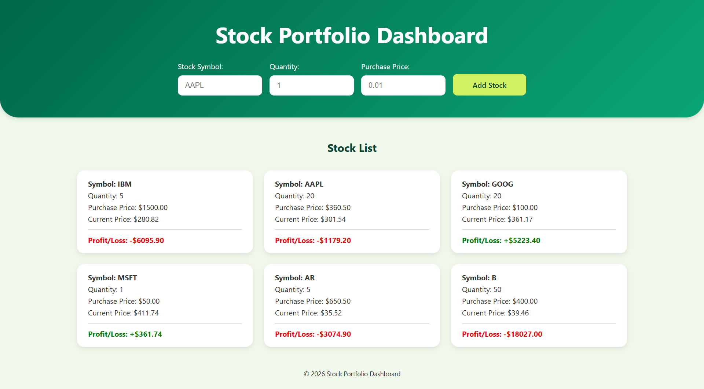

# 💹 Stock Portfolio Dashboard Web Application

A React-based Stock Portfolio Dashboard that allows users to track stock investments. Users can add stocks with quantity and purchase price, fetch real-time market prices using the `Alpha Vantage API`, and view profit or loss dynamically.

## 🌐 Live Demo

🔗 View app: https://rushdina.github.io/stock-portfolio-dashboard/



## 🛠️ Technologies Used

- **Frontend:** `React (Vite)`, `JavaScript`, `CSS`
- **State Management:** `Context API` – Centralises global stock state and shared logic across components
- **React Hooks:**
  - `useState`: Manages component state
  - `useEffect`: Handles conditional API fetching
  - `useContext`: Provides shared state across components
  - `useCallback`: Stabilises function references for performance optimisation
  - `useMemo`: Memoises context value to reduce unnecessary re-renders
- **External APIs:** [Alpha Vantage API](https://www.alphavantage.co/documentation/) – Provides real-time stock market data
- **npm Packages:** `nanoid` – Generates unique IDs for stable React keys
- **Testing:** `Vitest`, `React Testing Library`

## ✨ Features

- Add stocks with symbol, quantity, and purchase price
- Fetch real-time stock prices via API
- Compute and display color-coded profit/loss
- Automatically merge duplicate stocks with recalculated average purchase price
- Handle API errors (rate limits, invalid symbols, network issues)
- Responsive UI using `Flexbox` and `CSS Grid` with loading indicators

## 🧩 Architecture Overview

The application is structured using a modular and scalable frontend architecture:

- **Components** → UI rendering (`StockForm`, `StockList`, `StockItem`)
- **Custom Hook** (`useStocks`) → Centralised state and business logic
- **Context API** → Shared global state across components
- **API Layer** (`stockAPI.js`) → External data fetching
- **Utility Layer** (`stockUtils.js`) → Reusable calculations

This separation improves maintainability, reusability, and scalability.

## 🧠 Key Challenges & Solutions

**1. API Response Validation**  
The REST API could return invalid symbols, rate limits, incomplete data, or network errors.

**Solution:** Validated every API response and returned consistent success or error states for reliable data handling and user feedback.

**2. Merging Duplicate Stock Holdings**  
Users could purchase the same stock multiple times at different prices and quantities.

**Solution:** Merged duplicate holdings using weighted average purchase price calculations to maintain accurate portfolio data.

**3. Shared Portfolio State**  
Multiple components needed access to the same portfolio data and operations.

**Solution:** Centralised portfolio state and business logic in a custom hook and shared it through Context API.

**4. Testing Asynchronous Components**  
Components depended on shared state, asynchronous API requests, and React state updates. 

**Solution:** Mocked Context values and API responses to independently test components, business logic, and error handling.

## ✨ Improvements Beyond Baseline Requirements

- **Enhanced User Experience**:
  - Inline validation for invalid stock symbols
  - Separate error messages for input errors vs API errors
  - Loading indicators when fetching stock prices
  - Responsive interface for different screen sizes
- **Improved State Logic**:
  - Automatically merges duplicate stocks
  - Recalculates average purchase price dynamically
  - Uses nanoid to generate stable React keys
- **Performance Considerations**:
  - Memoized API functions with `useCallback`, `useMemo`
  - Conditional state updates to avoid unnecessary re-renders

## 📚 Key Learnings

- Designed a modular React architecture by separating UI, state management, API communication, and business logic into reusable modules.
- Learned to validate and handle unpredictable REST API responses, including invalid data, rate limits, and network failures.
- Applied Context API and custom hooks to centralise shared portfolio state and create a single source of truth.
- Implemented automated unit and component tests using Vitest and React Testing Library to verify business logic, user interactions, and edge cases.
- Integrated automated testing into a GitHub Actions CI/CD pipeline to verify code quality before every production build and deployment.

## 💻 Installation & Running Locally

1. **Clone the repository**

```bash
git clone https://github.com/<username>/<repository>.git
cd <repository>
```

2. **Install dependencies**

```bash
npm install
```

3. **Set up environment variables**

- Create a `.env` file in the root folder and add your `Alpha Vantage API` key:

```bash
VITE_ALPHA_KEY=your_alpha_vantage_api_key
```

You can obtain a free API key from: https://www.alphavantage.co/support/#api-key

4. **Run development server**

```bash
npm run dev
```

Open the localhost URL shown in your terminal (usually `http://localhost:5173`).

## 💡 Future Improvements

- Manual refresh button to update stock prices
- Persistent storage using localStorage or a backend database
- Stock price history visualization
- Portfolio summary statistics (total investment, total profit/loss)
- API request caching to reduce rate limit issues
